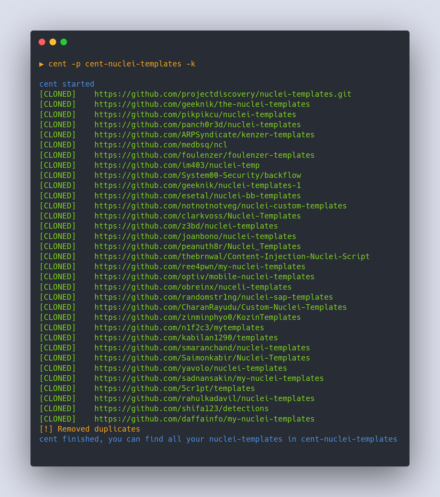

Community edition nuclei templates, a simple tool that allows you to organize all the Nuclei templates offered by the community in one place.

<p align="center">
<br>
<a href="https://github.com/xm1k3/cent/issues"></a>

<a href="https://github.com/xm1k3/cent/releases"></a>
<br>
<a href="https://github.com/xm1k3/cent/stargazers"></a>
<a href="https://twitter.com/xm1k3_"></a>
<br>
<br>
<br>
<a href="https://www.buymeacoffee.com/xm1k3"></a>
</p>

# Install
```
GO111MODULE=on go install -v github.com/xm1k3/cent@latest
```

Or [download from releases](https://github.com/xm1k3/cent/releases)
<br><br>

after installation run `cent init` to initialize cent with the configuration files you find [here](https://github.com/xm1k3/cent/blob/main/.cent.yaml) 


# Supported commands

| Command | Description            |
| ------- | ---------------------- |
| init    | Cent init configuration file      |
| update  | Update your repository |
| version  | Print cent version |

# Root flags

```
Flags:
      --config string   config file (default is $HOME/.cent.yaml)
  -C, --console         Print console output
  -k, --keepfolders     Keep folders (by default it only saves yaml files)
  -p, --path string     Root path to save the templates (default "cent-nuclei-templates")
  -t, --threads int     Number of threads to use when cloning repositories (default 10)
```

# Update flags
This command helps you update your folder with templates by deleting unnecessary folders and files without having to do multiples git clones.
```
Flags:
  -d, --directories   If true remove unnecessary folders from updated $HOME/.cent.yaml
  -f, --files         If true remove unnecessary files from updated $HOME/.cent.yaml
  -p, --path string   Path to folder with nuclei templates
```

# Init flags
This command will automatically download [`.cent.yaml`](https://raw.githubusercontent.com/xm1k3/cent/main/.cent.yaml) from repo and copy it to `$HOME/.cent.yaml`
```
Flags:
  -h, --help         help for init
  -o, --overwrite    If the cent file exists overwrite it
  -u, --url string   Url from which you can download the configurations for .cent.yaml
```

# Usage

```
▶ cent -h
▶ cent init -h
▶ cent update -h
▶ cent version
```
Example:

Clone and insert all the community templates into the `cent-nuclei-templates` folder 
```
▶ cent -p cent-nuclei-templates -k
```


If you have updated the `cent.yaml` file by adding new folders
```yaml
exclude-dirs:
  - ...
  - dns
  - ...
```
just do:
```
▶ cent update -p cent-nuclei-templates -d
```
and `cent` will automatically delete all `dns` folder present in `cent-nuclei-templates` without cloning all the github repos.


Same thing with `exclude-files`
```
▶ cent update -p cent-nuclei-templates -f
```
---
Once cent has been configured correctly you can perform a scan with Nuclei.

Example
```
▶ nuclei -u https://example.com -t ./cent-nuclei-templates -tags cve
▶ nuclei -l urls.txt -t ./cent-nuclei-templates -tags cve
```
See [here](https://nuclei.projectdiscovery.io/nuclei/get-started/#running-nuclei) for more documentation about Nuclei


# Config
You need to configure `cent` parameters in `$HOME/.cent.yaml`
```yaml
# Directories to exclude
exclude-dirs:
  - SOMETHING

# Files to exclude
exclude-files:
  - README.md
  - .gitignore
  - .pre-commit-config.yaml
  - LICENSE

# Add github urls
community-templates:
  - https://github.com/projectdiscovery/nuclei-templates.git
  - https://gist.github.com/0x240x23elu
  - https://gist.github.com/ResistanceIsUseless/e46848f67706a8aa1205c9d2866bff31
  - https://github.com/0x727/ObserverWard_0x727
  - https://github.com/1in9e/my-nuclei-templates
  - https://github.com/5cr1pt/templates
  - https://github.com/ARPSyndicate/kenzer-templates
  - https://github.com/AshiqurEmon/nuclei_templates.git
  - https://github.com/CharanRayudu/Custom-Nuclei-Templates
  - https://github.com/clarkvoss/Nuclei-Templates
  - https://github.com/d3sca/Nuclei_Templates
  - https://github.com/daffainfo/my-nuclei-templates
  - https://github.com/esetal/nuclei-bb-templates
  - https://github.com/ethicalhackingplayground/erebus-templates
  - https://github.com/foulenzer/foulenzer-templates
  - https://github.com/geeknik/nuclei-templates-1
  - https://github.com/geeknik/the-nuclei-templates
  - https://github.com/Harish4948/Nuclei-Templates
  - https://github.com/im403/nuclei-temp
  - https://github.com/javaongsan/nuclei-templates
  - https://github.com/joanbono/nuclei-templates
  - https://github.com/kabilan1290/templates
  - https://github.com/medbsq/ncl
  - https://github.com/meme-lord/Custom-Nuclei-Templates
  - https://github.com/MR-pentestGuy/nuclei-templates
  - https://github.com/n1f2c3/mytemplates
  - https://github.com/NitinYadav00/My-Nuclei-Templates
  - https://github.com/notnotnotveg/nuclei-custom-templates
  - https://github.com/obreinx/nuceli-templates
  - https://github.com/optiv/mobile-nuclei-templates
  - https://github.com/panch0r3d/nuclei-templates
  - https://github.com/peanuth8r/Nuclei_Templates
  - https://github.com/pikpikcu/my-nuclei-templates
  - https://github.com/pikpikcu/nuclei-templates
  - https://github.com/projectdiscovery/nuclei-templates.git
  - https://github.com/R-s0n/Custom_Vuln_Scan_Templates
  - https://github.com/rafaelcaria/Nuclei-Templates
  - https://github.com/rahulkadavil/nuclei-templates
  - https://github.com/randomstr1ng/nuclei-sap-templates
  - https://github.com/redteambrasil/nuclei-templates
  - https://github.com/ree4pwn/my-nuclei-templates
  - https://github.com/sadnansakin/my-nuclei-templates
  - https://github.com/Saimonkabir/Nuclei-Templates
  - https://github.com/Saptak9983/Nuclei-Template
  - https://github.com/securitytest3r/nuclei_templates_work
  - https://github.com/sharathkramadas/k8s-nuclei-templates
  - https://github.com/shifa123/detections
  - https://github.com/smaranchand/nuclei-templates
  - https://github.com/Str1am/my-nuclei-templates
  - https://github.com/System00-Security/backflow
  - https://github.com/test502git/log4j-fuzz-head-poc
  - https://github.com/thebrnwal/Content-Injection-Nuclei-Script
  - https://github.com/thelabda/nuclei-templates
  - https://github.com/yavolo/nuclei-templates
  - https://github.com/z3bd/nuclei-templates
  - https://github.com/zinminphyo0/KozinTemplates
```

## Credits
- [hakluke](https://twitter.com/hakluke)
- [Nuclei](https://twitter.com/pdnuclei)
- [Project Discovery](https://twitter.com/pdiscoveryio)
- [sec715](https://twitter.com/sec715)
- [geeknik](https://twitter.com/geeknik)
- [SYSTEM00 SECURITY](https://github.com/System00-Security)
- [clarkvoss](https://github.com/clarkvoss)
- [notnotnotveg](https://github.com/notnotnotveg)
- [Alra3ees - Emad Shanab](https://twitter.com/Alra3ees)
  - [Nuclei-Templates-Collection](https://github.com/emadshanab/Nuclei-Templates-Collection)

# Disclaimer

Disclaimer: The developer of this tool is not responsible for how the community uses the open source templates collected within it. These templates have not been validated by Project Discovery and are provided as-is.

# License
Cent is distributed under Apache-2.0 License
